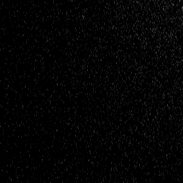
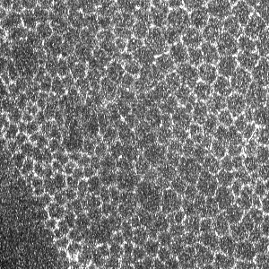
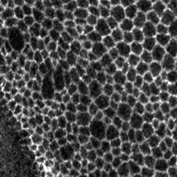
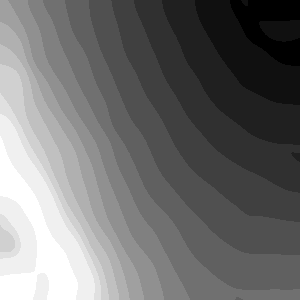

# Epiproj

| Image  | Maxium Projection | Epiproj |
| :--------:  | :--------: | :--------: |
|  |  |  |

This is a set of three ITK based filters to compute the depth image of a surface in a volume and to project the surface along the depth axis.
Those filters can be used independently or together. Here combined Epiproj - Epithelium Projection - to project in 2D an apical fluorescence signal of an epithelium.  
The Epiproj is a 2-step approach for computing the depth image of the signal (epiprojDepthMapGenerator) and projecting the signal (epiprojDepthMapProjector) based on the dept image.

## Requirements

[Insight ToolKit (ITK)](https://itk.org/) += 5.0  
[CMake](https://cmake.org/) += 3.0  

## Filters description

### itkVolumeToDepthMapFilter

ITK filter that take a nD image (optimised for 3D) and compute a depth map of the signal localisation as output.
The signal localisation detection m_Peak can be define as:

- the maximum intensity along the projection dimension
- the first relevant intensity peak along the projection dimension

The second definition require an additional value m_Tolerance to define the relevantness of the intensity
Finaly, an initialisation depth map can be provided to speed up the computation.

### itkMuliscaleVolumeToDepthMapFilter

An extention of the itkVolumeToDepthMapFilter that use a multiscale pyramide to compute the depth map.
Here the filter first compute the map at the lower scale of the pyramide and use the output as initialisation
for computing the map at the next scale level.
For an optimised processing cost, it allows to compute a precise depth map of the signal localisation.

### itkDepthMapProjectionFilter

This filter will apply a maximum or average projection of a volume around a provided corresponding depth map.

## Usage

Usage example of each filters can be found in their respective test:

- itkVolumeToDepthMapFilterTest.cxx
- itkMultiscaleVolumeToDepthMapFilterTest.cxx
- itkDepthMapProjectionFilterTest.cxx

## Epiproj

Using the three ITK filter, two scripts can be found in the epiproj folder.
Those script allows the computation of a depthmap from a volume and the projection
of the volume using the computed depthmap.  
Variouse parameters, smoothing, and preprocessing option were added to the script to
provide a usable two-steps projection program.

### Install

```
git clone git@gitlab.pasteur.fr:iah/epiproj.git  
mkdir epiproj/build  
cd epiproj/build  
ccmake -DCMAKE_BUILD_TYPE=Release ..  
make  
make test  
```

All tests should pass, and corresponding executable can be found in "bin" folder at the root of the project.

### epiprojDepthMapGenerator

```
Usage: ./epiprojDepthMapGenerator  
        InputFileName  (string) - path to input file.  
        OutputFileName (string) - path to output file.  
        Sigma (float)           - smoothing parameters.  
Options:   
        Type (string)     - Computation on maximum (max) or variance (var) intensity.  
        Level (int)       - Number of scaling level. (=5)  
        Peak (int)        - Detecting peak. (=0)  
        Tolerance (float) - Intensity ratio (=0.1).  
        Delta (int)       - Degree of freedom per step. (=1)  
```

The options allows different detection type and higly depend on the data and the output expected.
**Type** is a signal pre-processing option to compute the depthmap on.
The default value (max) means that no alteration of the signal is performed, the variance option apply a local 2d variance filter.
**Peak** allows to guide the intensity detection to the maximum peak (default behaviour) or to the first peak detected.
The peak relevantness are then defined by the **Tolerance** value, not used if detecting maximum peak.
Finaly the **Delta** is the ± freedom to explore at each scale step.
A low value will not allow the algorithm to get too far away that what he detected a low scale, on the contrary a too high value will make it to adapt too much to every imperfection of the signal.
See filter **itkDepthMapProjectionFilter** documentation for further details on the algorithm.

### epiprojDepthMapProjector

```
Usage: ./epiprojDepthMapProjector  
        InputFileName  (string) - path to input file.  
        DepthFileName (string)  - path to depth map file.  
        OutputFileName (string) - path to output file.  
Options:   
        Median (int)      - Median radius kernel. (=0)  
        Type (string)     - Projection type, maximum (max), average (avg) intensity.  
        upperRange (int)  - Upper range band. (=1)  
        lowerRange (int)  - Lower range band. (=1)  
        shift (int)       - Depth shift. (=0)  
```
The options allows different projection.
**Median** is a radius size of a pre-processing median filter applied to the signal before projection.
A 0 value will skill the filter.
**Type** will apply a projection type, maximum or average.
While maximum will yield the best contrast result, the average may be relevant for quantification purposes.
The **upperRange** and **lowerRange** are the number of z-plan upper and lower the depthmap you defined to be part of the projection band.
Finaly the **shift** is z-axis translation operation to be applied to the depthmap before projection.
See filter **itkVolumeToDepthMapFilter** and **itkMuliscaleVolumeToDepthMapFilter** documentation for further details on the algorithm.

## Epiproj examples

The depthmap can be compute on a pre-processed signal, like on the local variance filter response, or on the raw signal, depending on the data and signal inside.
The 2-steps approach allow then to project the raw signal with the local variance depthmap for example.

| Image  | Local Variance | Depth Map | Projection |
| :--------:  | :--------: | :--------: | :--------: |
|  |  |  |  |


## How to cite 
``` 
@ebook{rigaud2020,
  author        = "{St\'ephane Rigaud}",
  title         = "Epiproj : A multiscale epithelium projection filter.",
  url           = "https://gitlab.pasteur.fr/iah/epiproj",
  year          = "2015",
  doi           = 
}
``` 
